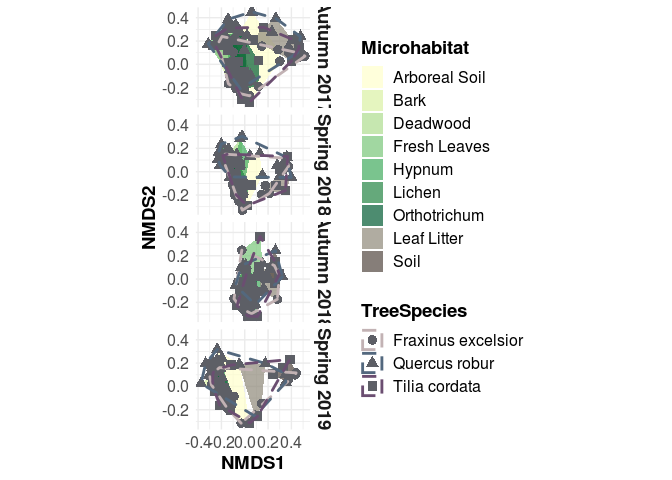
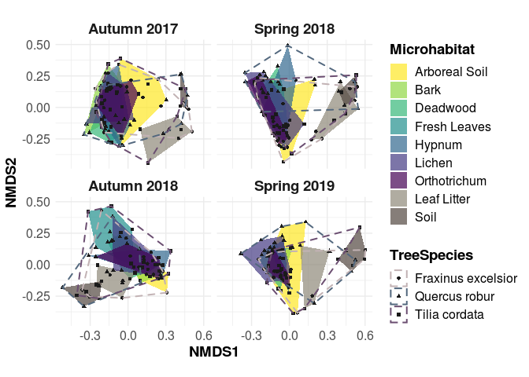

Nonmetric Multidimensional Scaling
================

**NMDS** is a method for visualising differences in community
composition among samples, using distance matrices like the Bray-Curtis
matrix. The idea is to visualise multiple dimensions (i.e. communities,
samples, microhabitats, …) in a 2-dimensional plot.

For more information, there is a fantastic tutorial by [Jon
Lefcheck](https://jonlefcheck.net/2012/10/24/nmds-tutorial-in-r/), which
guides you through the basics of an NMDS analysis in R.

## Load Packages and OTU Table

``` r
rm(list = ls())

library(vegan)
library(ggplot2)
library(funrar)
library(ggpubr)
library(RColorBrewer)
library(dplyr)
library(viridis)

#setwd("05_Beta_Diversity/")

OTU_Table = read.csv("../00_Data/05_Oomycota_Seasonal_OTU_Table_min-freq-1172_transposed_withMetadata.tsv", 
                     header=T, stringsAsFactors=TRUE, sep="\t")


species = OTU_Table[,18:ncol(OTU_Table)]
species_mat = as.matrix(species)
species_mat = make_relative(species_mat)
species_mat = log(species_mat +1)
SampleMetadata = as.data.frame(OTU_Table[,1:17])
```

## Preparing the data

First, we need a distance matrix. We use the `vegdist` function, which
by default builds the distance matrix based on the
*Bray-Curtis-Distance*. This matrix is then parsed into the `metaMDS`
function. The resulting object contains a lot of information, but we
need to add the metadata information (like Microhabitat or Tree Species)
for the plot. With that, we can group the points and connect them by
metadata, to further visualise differences in our samples.

``` r
## Calculate permANOVA and store results in a dataframe

i = 1
for(Variable in colnames(SampleMetadata)){
  if(i == 1){
    adonistable = as.data.frame(adonis(species_mat ~ SampleMetadata[[Variable]])$aov.tab)[1,]
  } else{
    adonistable = rbind(adonistable, as.data.frame(adonis(species_mat ~ SampleMetadata[[Variable]])$aov.tab)[1,])
  }
  i = i + 1
}
rownames(adonistable) = colnames(SampleMetadata)

Dist = vegdist(species_mat, 
               diag = T, 
               na.rm = T)

OTU.NMDS.bray = metaMDS(Dist, # The distance matrix
                        k=3, # How many dimensions/axes to display 
                        trymax=200, # max number of iterations
                        wascores=TRUE, # Weighted species scores
                        trace=TRUE,
                        zerodist="add") # What to do with 0's after sqrt transformation

# Get the sample scores and add the metadata
data.scores = as.data.frame(scores(OTU.NMDS.bray))
data.scores$site = rownames(data.scores)
data.scores$Microhabitat = SampleMetadata$Microhabitat
data.scores$Stratum = SampleMetadata$Stratum
data.scores$TreeSpecies = SampleMetadata$TreeSpecies
data.scores$MicrohabitatPerSampling = SampleMetadata$MicrohabitatPerSampling
data.scores$SamplingDescription = SampleMetadata$SamplingDescription
data.scores$SamplingDate = SampleMetadata$SamplingDate
data.scores$TreeSpeciesPerSampling = SampleMetadata$TreeSpeciesPerSampling

for(a in unique(SampleMetadata$MicrohabitatPerSampling)){
  a = get("a")
  a_short = gsub(" ", "", a)
  b = paste0("MicrohabitatGroup.", a_short)
  b = get("b")
  #print(b)
  assign(b, data.scores[data.scores$MicrohabitatPerSampling == a,][chull(data.scores[data.scores$MicrohabitatPerSampling == a, c("NMDS1", "NMDS2")]), ])
}

MicrohabitatGroups = do.call("rbind", lapply(ls(pattern = "MicrohabitatGroup\\."),get))
MicrohabitatGroups$SamplingDescription = factor(MicrohabitatGroups$SamplingDescription, levels=c('Autumn 2017','Spring 2018','Autumn 2018','Spring 2019'))

for(a in unique(SampleMetadata$TreeSpeciesPerSampling)){
  a = get("a")
  a_short = gsub(" ", "", a)
  b = paste0("TreeGroup.", a_short)
  b = get("b")
  #print(b)
  assign(b, data.scores[data.scores$TreeSpeciesPerSampling == a,][chull(data.scores[data.scores$TreeSpeciesPerSampling == a, c("NMDS1", "NMDS2")]), ])
}

TreeGroups = do.call("rbind", lapply(ls(pattern = "TreeGroup\\."),get))
TreeGroups$SamplingDescription = factor(TreeGroups$SamplingDescription, levels=c('Autumn 2017','Spring 2018','Autumn 2018','Spring 2019'))
```

## Plot with ggplot2

I personally do not like the default colours from `ggplot`. So here I
use colours corresponding to the YlGn Palette from
[ColorBrewer](http://colorbrewer2.org/#type=sequential&scheme=YlGn&n=7).

``` r
g = ggplot() + 
  geom_polygon(data = MicrohabitatGroups, 
               aes(x=NMDS1, y=NMDS2, group = MicrohabitatPerSampling, fill = Microhabitat), 
               alpha = 0.7) + 
  #scale_fill_viridis_d() +
  scale_fill_manual(limits = c("Arboreal Soil", "Bark", "Deadwood", 
                               "Fresh Leaves",  "Hypnum", "Lichen", 
                               "Orthotrichum", "Leaf Litter", "Soil"), 
                    values = c(brewer.pal(7, "YlGn"), 
                               "#8e8878", "#524640")) +  
  geom_point(data = data.scores, 
             aes(x = NMDS1, y = NMDS2, shape = TreeSpecies), 
             size = 3,
             color = "#5d5f66") + 
  geom_polygon(data = TreeGroups, 
               aes(x=NMDS1, y=NMDS2, group = TreeSpeciesPerSampling, color = TreeSpecies),
               alpha = 0.7, fill = NA, linetype = "dashed", size = 1) +
  scale_color_manual(values = c("#c2b2b4", "#53687e", "#6b4e71")) +
  #geom_text(aes(x = 0.4, y = -0.25, label = as.character(paste0(OTU.NMDS.bray$ndim, "D Stress: ", round(as.numeric(OTU.NMDS.bray$stress), digits = 4)))), parse = F, color = "#5d5f66", size = 4) +
  coord_equal() + 
  theme_minimal() +
  #labs(title = "Oomycota") +
  theme(axis.text=element_text(size=12), 
        axis.title=element_text(size=14, face = "bold"), 
        legend.text = element_text(size = 12), 
        legend.title = element_text(size = 14, face = "bold"), 
        legend.position = "right", 
        legend.direction = "vertical", 
        strip.text.y = element_text(size=14, face = "bold"), 
        plot.title = element_text(size = 20, face = "bold", hjust = 0.5)) + 
  facet_grid(rows = vars(SamplingDescription))

g
```

<!-- -->

## Cluster Separately

``` r
species_mat_Autumn2017 = species_mat[OTU_Table$SamplingDescription == "Autumn 2017",]
species_mat_Spring2018 = species_mat[OTU_Table$SamplingDescription == "Spring 2018",]
species_mat_Autumn2018 = species_mat[OTU_Table$SamplingDescription == "Autumn 2018",]
species_mat_Spring2019 = species_mat[OTU_Table$SamplingDescription == "Spring 2019",]

Dist_Autumn2017 = vegdist(species_mat_Autumn2017, diag = T, na.rm = T)
OTU.NMDS.bray_Autumn2017 = metaMDS(Dist_Autumn2017, k=3, trymax=300, wascores=TRUE, trace=TRUE, zerodist="add")

Dist_Spring2018 = vegdist(species_mat_Spring2018, diag = T, na.rm = T)
OTU.NMDS.bray_Spring2018 = metaMDS(Dist_Spring2018, k=3, trymax=300, wascores=TRUE, trace=TRUE, zerodist="add")

Dist_Autumn2018 = vegdist(species_mat_Autumn2018, diag = T, na.rm = T)
OTU.NMDS.bray_Autumn2018 = metaMDS(Dist_Autumn2018, k=3, trymax=300, wascores=TRUE, trace=TRUE, zerodist="add")

Dist_Spring2019 = vegdist(species_mat_Spring2019, diag = T, na.rm = T)
OTU.NMDS.bray_Spring2019 = metaMDS(Dist_Spring2019, k=3, trymax=300, wascores=TRUE, trace=TRUE, zerodist="add")

data.scores_sep = as.data.frame(rbind(scores(OTU.NMDS.bray_Spring2018), 
                                      scores(OTU.NMDS.bray_Spring2019),
                                      scores(OTU.NMDS.bray_Autumn2017), 
                                      scores(OTU.NMDS.bray_Autumn2018)))
rownames(data.scores_sep) = SampleMetadata$SampleID
data.scores_sep$site = rownames(data.scores_sep)
data.scores_sep$Microhabitat = SampleMetadata$Microhabitat
data.scores_sep$Stratum = SampleMetadata$Stratum
data.scores_sep$TreeSpecies = SampleMetadata$TreeSpecies
data.scores_sep$MicrohabitatPerSampling = SampleMetadata$MicrohabitatPerSampling
data.scores_sep$SamplingDescription = SampleMetadata$SamplingDescription
data.scores_sep$SamplingDate = SampleMetadata$SamplingDate
data.scores_sep$TreeSpeciesPerSampling = SampleMetadata$TreeSpeciesPerSampling

for(a in unique(SampleMetadata$MicrohabitatPerSampling)){
  a = get("a")
  a_short = gsub(" ", "", a)
  b = paste0("MicrohabitatGroup_sep.", a_short)
  b = get("b")
  #print(b)
  assign(b, data.scores_sep[data.scores_sep$MicrohabitatPerSampling == a,][chull(data.scores_sep[data.scores_sep$MicrohabitatPerSampling == a, c("NMDS1", "NMDS2")]), ])
}

MicrohabitatGroups_sep = do.call("rbind", lapply(ls(pattern = "MicrohabitatGroup_sep\\."),get))
MicrohabitatGroups_sep$SamplingDescription = factor(MicrohabitatGroups_sep$SamplingDescription, levels=c('Autumn 2017','Spring 2018','Autumn 2018','Spring 2019'))

for(a in unique(SampleMetadata$TreeSpeciesPerSampling)){
  a = get("a")
  a_short = gsub(" ", "", a)
  b = paste0("TreeGroup_sep.", a_short)
  b = get("b")
  #print(b)
  assign(b, data.scores_sep[data.scores_sep$TreeSpeciesPerSampling == a,][chull(data.scores_sep[data.scores_sep$TreeSpeciesPerSampling == a, c("NMDS1", "NMDS2")]), ])
}

TreeGroups_sep = do.call("rbind", lapply(ls(pattern = "TreeGroup_sep\\."),get))
TreeGroups_sep$SamplingDescription = factor(TreeGroups_sep$SamplingDescription, levels=c('Autumn 2017','Spring 2018','Autumn 2018','Spring 2019'))

g = ggplot() + 
  geom_polygon(data = MicrohabitatGroups_sep, 
               aes(x=NMDS1, y=NMDS2, group = MicrohabitatPerSampling, fill = Microhabitat), 
               alpha = 0.7) + 
  #scale_fill_viridis_d() +
  scale_fill_manual(limits = c("Arboreal Soil", "Bark", "Deadwood", 
                               "Fresh Leaves",  "Hypnum", "Lichen", 
                               "Orthotrichum", "Leaf Litter", "Soil"), 
                    values = c(viridis(7, direction = -1), 
                               "#8e8878", "#524640")) + 
  geom_point(data = data.scores_sep, 
             aes(x = NMDS1, y = NMDS2, shape = TreeSpecies), 
             size = 1.25,
             color = "grey10") + 
  geom_polygon(data = TreeGroups_sep, 
               aes(x=NMDS1, y=NMDS2, group = TreeSpeciesPerSampling, color = TreeSpecies),
               alpha = 0.7, fill = NA, linetype = "dashed", size = 0.7) +
  scale_color_manual(values = c("#c2b2b4", "#53687e", "#6b4e71")) +
  #geom_text(aes(x = 0.4, y = -0.25, label = as.character(paste0(OTU.NMDS.bray$ndim, "D Stress: ", round(as.numeric(OTU.NMDS.bray$stress), digits = 4)))), parse = F, color = "#5d5f66", size = 4) +
  coord_equal() + 
  theme_minimal() +
  #labs(title = "Oomycota") +
  theme(axis.text=element_text(size=12), 
        axis.title=element_text(size=14, face = "bold"), 
        legend.text = element_text(size = 12), 
        legend.title = element_text(size = 14, face = "bold"), 
        legend.position = "right", 
        legend.direction = "vertical", 
        strip.text = element_text(size=14, face = "bold"), 
        plot.title = element_text(size = 20, face = "bold", hjust = 0.5)) + 
  facet_wrap(facets = vars(SamplingDescription))
```

## Combine Plots

``` r
g$labels$title = NULL

ggsave("NMDS_SeparatelyClustered.png", plot = g, 
       device = "png", dpi = 600, width = 18, height = 14, 
       units = "cm")
ggsave("NMDS_SeparatelyClustered.jpeg", plot = g, 
       device = "jpeg", dpi = 600, width = 18, height = 14, 
       units = "cm")
ggsave("NMDS_SeparatelyClustered.pdf", plot = g, 
       device = "pdf", dpi = 600, width = 18, height = 14, 
       units = "cm")

g
```

<!-- -->
