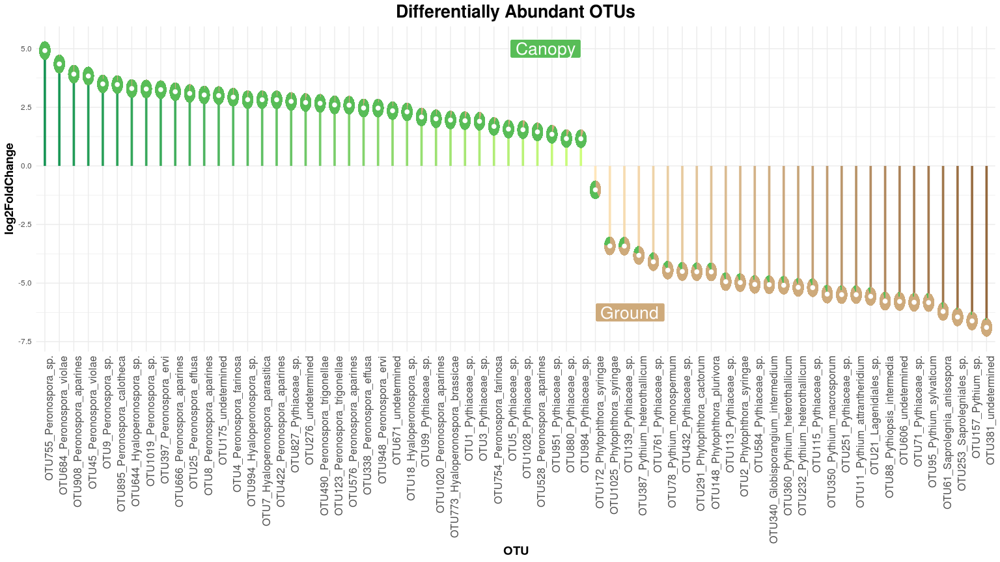
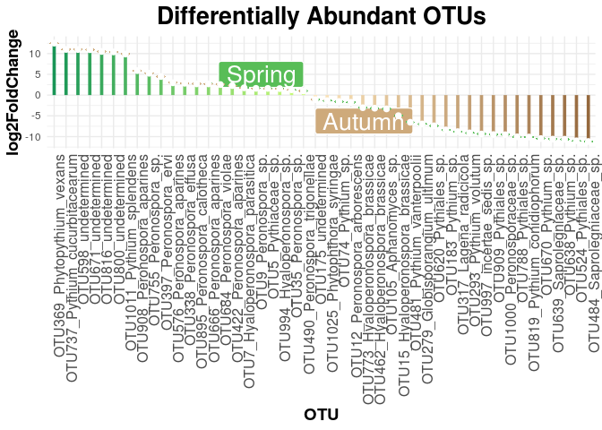
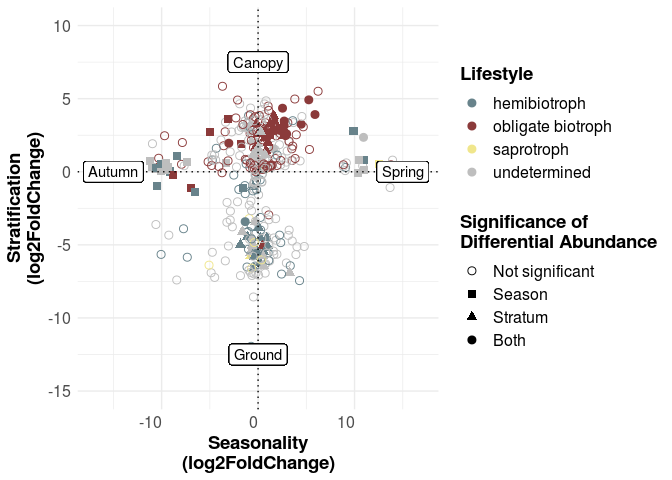

Differential Abundance Analysis
================

In our previous beta-diversity analysis, we have seen that there is a
high dissimilarity between Canopy-habitats and Ground-habitats.  
Let’s find out if there are any key players shaping this dissimilarity.

To do so, we use the tool `DESeq2`  
It was originally designed for differential gene expression based on RNA
read counts, but we can also use it on our OTU table, as it is also
count data.

\#\#Loading Data

First, we need to load the required R packages and the OTU table. We
also define Metadata for our analysis (in this case, Microhabitat and
Stratum and so on)

``` r
rm(list = ls())

library(DESeq2)
library(apeglm)
library(magrittr)
library(ggplot2)
library(plyr)
library(scatterpie)
library(stringr)
library(ggpubr)

#setwd("/media/robin/Data/01_PhD/01_2017_Autumn/Oomycota/06_Networks")

OTU_Table = read.csv("../00_Data/05_Oomycota_Seasonal_OTU_Table_min-freq-1172_transposed_withMetadata.tsv", 
                     header=T, stringsAsFactors=TRUE, sep="\t")
TaxonomyTable = read.csv("../00_Data/04_Oomycota_Seasonal_OTU_ContingencyTable_filtered_sequences_NCBI-nt_blasted_sorted_BestHit_TaxonomyTable_Oomycetes_sequences_vsearch-ITS1-BestHit_AnnotationRefined_noPipe_withFunction_noNA.tsv", 
                         header = F, stringsAsFactors = T, sep = "\t", row.names = 1)
TaxonomyTable = TaxonomyTable[,c(1:4, 7:8)]
colnames(TaxonomyTable) = c("Order", "Family", "Genus", 
                            "Species", "Lifestyle", "Substrate")
TaxonomyTable$Species = gsub("Genus_NoHit_Species_NoHit", "undetermined", 
                             TaxonomyTable$Species)
TaxonomyTable$Species = gsub("Species_NoHit", "sp.", 
                             TaxonomyTable$Species)
TaxonomyTable$Species = paste0("OTU", rownames(TaxonomyTable),
                               "_", TaxonomyTable$Species)
TaxonomyTable$Order = gsub("Order_NoHit", "Undetermined", 
                           TaxonomyTable$Order)
TaxonomyTable$Order = gsub("incertae_sedis", "Incertae sedis", 
                           TaxonomyTable$Order)


species = OTU_Table[,18:ncol(OTU_Table)]
species_mat = as.matrix(species)
SampleMetadata = as.matrix(OTU_Table[,1:17])
```

\#\#DESeq2

Workflow adapted from
`https://bioconductor.org/packages/release/bioc/vignettes/DESeq2/inst/doc/DESeq2.html#standard-workflow`  
The OTU table is here converted into a DESeq2 object.

``` r
#Read the OTU table into a DESeq2 object
ddsStratum = DESeqDataSetFromMatrix(countData = t(species_mat),
                                    colData = SampleMetadata,
                                    design = ~ Stratum)

#Do the differential abundance analysis
ddsStratum = DESeq(ddsStratum, 
                   minReplicatesForReplace = Inf, #This means that Outliers should not be excluded, we want the maximum amount of information
                   sfType = "poscounts",
                   quiet = T)

#Convert the analysis into a clearly readable results table
resStratum = results(ddsStratum, pAdjustMethod = "BH")

#Shrink the LFC (Log Fold Change)
#This shrinks the lfc into  a normal distribution, which is very handy for visualisations
resStratumLFC = lfcShrink(ddsStratum, 
                          type = "apeglm", 
                          res = resStratum, 
                          coef = "Stratum_Ground_vs_Canopy", 
                          quiet = T)
```

Let’s have a look at the results table:

    ## log2 fold change (MAP): Stratum Ground vs Canopy 
    ## Wald test p-value: Stratum Ground vs Canopy 
    ## DataFrame with 6 rows and 5 columns
    ##                                                                                                        baseMean
    ##                                                                                                       <numeric>
    ## X10_Lagenidiales.Lagenidiales_Family_NoHit.Lagenidiales_Genus_NoHit.Lagenidiales_Species_NoHit 346.296754600467
    ## X44_Peronosporales.Peronosporaceae.Peronosporaceae_Genus_NoHit.Peronosporaceae_Species_NoHit   111.285282281881
    ## X57_Saprolegniales.Saprolegniaceae.Pythiopsis.Pythiopsis_intermedia                             52.955745603838
    ## X61_Saprolegniales.Saprolegniaceae.Saprolegnia.Saprolegnia_anisospora                          59.8877318312118
    ## X36_Saprolegniales.Saprolegniaceae.Saprolegniaceae_Genus_NoHit.Saprolegniaceae_Species_NoHit    89.152720580986
    ## X14_Lagenidiales.Lagenidiales_Family_NoHit.Lagenidiales_Genus_NoHit.Lagenidiales_Species_NoHit 250.591705571964
    ##                                                                                                    log2FoldChange
    ##                                                                                                         <numeric>
    ## X10_Lagenidiales.Lagenidiales_Family_NoHit.Lagenidiales_Genus_NoHit.Lagenidiales_Species_NoHit  -1.36168344799441
    ## X44_Peronosporales.Peronosporaceae.Peronosporaceae_Genus_NoHit.Peronosporaceae_Species_NoHit    -2.02646234994763
    ## X57_Saprolegniales.Saprolegniaceae.Pythiopsis.Pythiopsis_intermedia                              3.20255985099499
    ## X61_Saprolegniales.Saprolegniaceae.Saprolegnia.Saprolegnia_anisospora                            6.21088103762039
    ## X36_Saprolegniales.Saprolegniaceae.Saprolegniaceae_Genus_NoHit.Saprolegniaceae_Species_NoHit   -0.120807302501731
    ## X14_Lagenidiales.Lagenidiales_Family_NoHit.Lagenidiales_Genus_NoHit.Lagenidiales_Species_NoHit   1.57729536152472
    ##                                                                                                            lfcSE
    ##                                                                                                        <numeric>
    ## X10_Lagenidiales.Lagenidiales_Family_NoHit.Lagenidiales_Genus_NoHit.Lagenidiales_Species_NoHit 0.668443111601936
    ## X44_Peronosporales.Peronosporaceae.Peronosporaceae_Genus_NoHit.Peronosporaceae_Species_NoHit    0.50584539836023
    ## X57_Saprolegniales.Saprolegniaceae.Pythiopsis.Pythiopsis_intermedia                            0.612203685634931
    ## X61_Saprolegniales.Saprolegniaceae.Saprolegnia.Saprolegnia_anisospora                          0.599329665941852
    ## X36_Saprolegniales.Saprolegniaceae.Saprolegniaceae_Genus_NoHit.Saprolegniaceae_Species_NoHit   0.612957094836867
    ## X14_Lagenidiales.Lagenidiales_Family_NoHit.Lagenidiales_Genus_NoHit.Lagenidiales_Species_NoHit 0.508238597774344
    ##                                                                                                              pvalue
    ##                                                                                                           <numeric>
    ## X10_Lagenidiales.Lagenidiales_Family_NoHit.Lagenidiales_Genus_NoHit.Lagenidiales_Species_NoHit                   NA
    ## X44_Peronosporales.Peronosporaceae.Peronosporaceae_Genus_NoHit.Peronosporaceae_Species_NoHit                     NA
    ## X57_Saprolegniales.Saprolegniaceae.Pythiopsis.Pythiopsis_intermedia                                              NA
    ## X61_Saprolegniales.Saprolegniaceae.Saprolegnia.Saprolegnia_anisospora                          2.29870264996358e-25
    ## X36_Saprolegniales.Saprolegniaceae.Saprolegniaceae_Genus_NoHit.Saprolegniaceae_Species_NoHit                     NA
    ## X14_Lagenidiales.Lagenidiales_Family_NoHit.Lagenidiales_Genus_NoHit.Lagenidiales_Species_NoHit                   NA
    ##                                                                                                                padj
    ##                                                                                                           <numeric>
    ## X10_Lagenidiales.Lagenidiales_Family_NoHit.Lagenidiales_Genus_NoHit.Lagenidiales_Species_NoHit                   NA
    ## X44_Peronosporales.Peronosporaceae.Peronosporaceae_Genus_NoHit.Peronosporaceae_Species_NoHit                     NA
    ## X57_Saprolegniales.Saprolegniaceae.Pythiopsis.Pythiopsis_intermedia                                              NA
    ## X61_Saprolegniales.Saprolegniaceae.Saprolegnia.Saprolegnia_anisospora                          2.09437352552238e-24
    ## X36_Saprolegniales.Saprolegniaceae.Saprolegniaceae_Genus_NoHit.Saprolegniaceae_Species_NoHit                     NA
    ## X14_Lagenidiales.Lagenidiales_Family_NoHit.Lagenidiales_Genus_NoHit.Lagenidiales_Species_NoHit                   NA

The `log2FoldChange` represents the differential abundance. As the
design is `Stratum Ground vs Canopy`, positive values indicate a
dependence on `Ground`, while OTUs with a negative value are more
differentially abundant in the `Canopy`

\#\#Subset the data

We want only highly significant OTUs, so we filter our results table
`resStratumLFC` based on the `padj` value

``` r
DESeq_Stratum_dependend_Subset = subset(resStratumLFC, 
                                        resStratumLFC$padj < 0.01 #highly significant pvalues less than 0.01
                                        & abs(resStratumLFC$log2FoldChange) >= 1) #OTUs highly differential abundant, with an absolute LFC greater than 1

#Convert into a dataframe and sort by LFC
data = data.frame(DESeq_Stratum_dependend_Subset[order(DESeq_Stratum_dependend_Subset$log2FoldChange),]$log2FoldChange)
colnames(data) = "log2FoldChange"

#For the visualisation, the values are inverted so ground-associated OTUs appear at the bottom and "Canopy-OTUs" at the top
data$log2FoldChange = data$log2FoldChange * -1
```

\#\#Get the number of reads per OTU and Stratum \#\#\#How are the
differential abundant OTUs distributed?

To answer that, we add an extra column to our results table which shows
the abundance of the OTUs per Stratum  
The abundance in this case is the number of reads per OTU in the
respective strata

``` r
#Create empty matrices, one for the Ground Stratum and one for the Canopy
CanopyMatrix = matrix(numeric(0), 0,0)
GroundMatrix = matrix(numeric(0), 0,0)

#Then we fill the matrices with the number of reads per OTU and Stratum
for (a in as.factor(rownames(data))){ #The rownames are the names of the OTU
  a = get("a")
  get("OTU_Table")
  CanopyMatrix[[a]] = sum(OTU_Table[[a]][OTU_Table$Stratum == "Canopy"]) #All reads associated with Bark, Deadwood etc are summed
  GroundMatrix[[a]] = sum(OTU_Table[[a]][OTU_Table$Stratum == "Ground"]) #All reads associated with Soil and Leaf Litter are summed
}

#Convert Matrices to dataframes and add column names
GroundMatrix = as.data.frame(GroundMatrix, header = F)
CanopyMatrix = as.data.frame(CanopyMatrix, header = F)
colnames(GroundMatrix) = "Ground"
colnames(CanopyMatrix) = "Canopy"

#Add the new columns to our data
data = cbind(data, GroundMatrix, CanopyMatrix)

#We don't need the baseMean or pvalues etc., so we subset the data and keep only the LFC (which will be the y-coordinates in the plot) and the Ground and Canopy Columns
data = subset(data, select = c("log2FoldChange", "Ground", "Canopy"))

#We need to add an extra column for the x-coordinates in the plot, this is just a sequence from 1 to the number of OTUs
data$xPosition = seq(1:nrow(data))

#data = cbind(as(data, "data.frame"), as(TaxonomyTable[str_remove_all(rownames(data), "X"),], "matrix"))

data = cbind(as(data, "data.frame"), as(TaxonomyTable[gsub("[^0-9]", "", rownames(data)),], "matrix"))

rownames(data) = data$Species
```

\#\#Plot the Differential Abundance

Finally, our results can be plotted with ggplot2

``` r
g = data %>% #pipe the data into ggplot
  #arrange(data$log2FoldChange, decreasing = T) %>% #Not sure if this is actually needed, because we already sorted the data. I keep it nevertheless
  mutate(x = factor(rownames(data), rownames(data))) %>% #Define the OTUs as x-coordinates
  ggplot(aes(x = x, y = data$log2FoldChange)) + #x are the OTUs, y the LFC values
  geom_segment(aes(x=x, xend=x, #geom_segment is similar to a barplot, but you can control the width and other aesthetics
                    y=0, yend = data$log2FoldChange), 
                size=1.3, alpha=0.9, #size is the width of the bars, alpha the transparency
               #The color is a bit tricky. I want to plot smaller LFCs in lighter green/brown and higher LFC in darker colors
               #So I generate a sequential palette first from dark green to light green
               #Then I specify how many colors I need, this is the total number of OTUs with a positive LFC (sum data$lfc > 0)
                color = c(colorRampPalette(c("springgreen4", "darkolivegreen1"))(sum(data$log2FoldChange > 0)), 
               #For the ground OTUs, I generate a palette from light to dark brown as the first ground OTU has the "lowest" LFC
               #Then I again specify how many brown colors I want, namely the number of OTUs with a negative LFC
                          colorRampPalette(c("moccasin", "tan4"))(sum(data$log2FoldChange < 0))), 
               position = position_dodge(width = 0.5)) + #Can't really remember what this does
  theme_minimal() + #The theme for the plot, less is more ;)
  theme(legend.position = "none", #We don't need a legend
        panel.border = element_blank(), #No panel borders
        axis.text.x = element_text(size = 12, angle = 90, vjust = 1, hjust = 1),
        axis.title=element_text(size=14, face = "bold"),  
        plot.title = element_text(size = 20, face = "bold", hjust = 0.5)) + #Title should be in the middle (hjust 0.5) and bold (actual text not yet specified here)
  xlab("OTU") + #Axis title for x axis
  ylab("log2FoldChange") + #Axis title for y axis
  labs(title = "Differentially Abundant OTUs") + #labs targets all labels, here I specify the text of the title
  #With geom_label we can specify our own labels, in this case "Canopy" and "Ground"
  geom_label(x = 38, y = 5, label = " Canopy", fill = "#58BD57", color = "white", size = 7, hjust = 1) +
  geom_label(x = 39, y = -6.25, label = "Ground ", fill = "#CEAA7B", color = "white", size = 7, hjust = 0) + 
  #Scatterpie is a mixture of piecharts and scatterplots
  #I want to show the number of reads per stratum per OTU in a piechart to identify OTUs which are differentialy abundant but not exclusively present in one stratum
  geom_scatterpie(data = data, #read the data
                  #IMPORTANT: very contraintuitive, but dont put the columns in "quotationmarks" and also dont call the columns with e.g. data$xPosition, this will give errors
                  aes(x = xPosition, y = log2FoldChange, r = 0.4), #define x and y coordinates and radius for each pie
                  cols = c("Ground", "Canopy"), #the columns which will be used for the pie charts, here the number of reads per Ground and Canopy
                  color = NA) + #color will only color the borders of the pies, the actual fill color is specified below
  scale_fill_manual(values=c("#58BD57", "#CEAA7B")) + #fill the piecharts with green and brown
  geom_point(size = 2, fill = "white", color = "white") #Here I plot white circles to make the piecharts look like donuts, not necessary, but I think it looks better

g
```

<!-- -->

## With Taxonomy

It is important to put the results into a taxonomic and functional
context. So now we associate data to our OTUs and plot the results in a
different manner:

``` r
## sort the data
x = tapply(data$log2FoldChange, data$Order, function(x) max(x))
x = sort(x, T)
data$Order = factor(as.character(data$Order), levels = names(x))

data$Genus = gsub("^Genus_NoHit", "undetermined", data$Genus)
data$Genus = gsub("Genus_NoHit", "gen.", data$Genus)

x = tapply(data$log2FoldChange, data$Genus, function(x) max(x))
x = sort(x, T)
data$Genus = factor(as.character(data$Genus), levels = names(x))

x = tapply(data$log2FoldChange, data$Family, function(x) max(x))
x = sort(x, T)
data$Family = factor(as.character(data$Family), levels = names(x))

x = tapply(data$log2FoldChange, data$Lifestyle, function(x) max(x))
x = sort(x, T)
data$Lifestyle = factor(as.character(data$Lifestyle), levels = names(x))

data$Stratum = ifelse(data$log2FoldChange > 0, "Canopy", "Ground")
data$Order = gsub("Peronosporales", "Perono-\nsporales", data$Order)
data$Order = gsub("Undetermined", "Unde-\ntermined", data$Order)
data$Order = gsub("Lagenidiales", "Lageni-\ndiales", data$Order)
data$Order = gsub("Saprolegniales", "Saproleg-\nniales", data$Order)

g_tax = ggplot(data, aes(x = Genus, y = log2FoldChange, 
                         color = Lifestyle, fill = Lifestyle)) + 
  scale_color_manual(values = c("lightsteelblue4", "indianred4", 
                               "bisque4", "honeydew3"), 
                    limits = c("hemibiotroph", "obligate biotroph", 
                               "saprotroph", "undetermined")) +
  scale_fill_manual(values = c("lightsteelblue4", "indianred4", 
                               "bisque4", "honeydew3"), 
                    limits = c("hemibiotroph", "obligate biotroph", 
                               "saprotroph", "undetermined")) +
  theme_minimal() +
  #geom_boxplot(width = 0.2, fill = NA, color = NA) +
  #geom_violin(aes(x = Genus, y = log2FoldChange), 
  #            scale = "area", trim = F, bw = 0.95, 
  #            fill = NA, size = 1.5) +
  #scale_fill_gradient2(low = "blue", high = "red") + 
  #geom_hex(binwidth = 0.2) + 
  geom_dotplot(aes(x = Genus, y = log2FoldChange), 
              binaxis = "y", stackdir = "center", 
               binwidth = 0.5, binpositions = "all", 
               dotsize = 0.9, color = "black", 
               position = "identity", width = 1, 
               stackratio = 1, stackgroups = F, 
               method = "histodot") + 
  theme(axis.text=element_text(size=8), 
        axis.text.x = element_text(angle = 45, hjust = 1, vjust = 1), 
        axis.title=element_text(size=8, face = "bold"), 
        legend.text = element_text(size = 8), 
        legend.title = element_text(size = 8, face = "bold"), 
        legend.position = "right", 
        legend.direction = "vertical", 
        plot.title = element_text(size = 20, face = "bold", hjust = 0.5), 
        strip.text = element_text(size=7, face = "bold"), 
        panel.background = element_blank(), 
        panel.border = element_rect(color = "grey20", fill = NA, size = 1)) +
  scale_y_continuous(breaks = seq(-8, 6, by = 2)) +
  guides(fill = guide_legend(override.aes = list(size = 3))) +
  facet_grid(cols = vars(Order), scales = "free", space = "free", 
             rows = vars(Stratum), switch = "y")

ggsave("DifferentialAbundanceAnalysis_Stratum.pdf", plot = g_tax, 
       device = "pdf", dpi = 300, width = 18, height = 9, 
       units = "cm")
ggsave("DifferentialAbundanceAnalysis_Stratum.png", plot = g_tax, 
       device = "png", dpi = 300, width = 18, height = 9, 
       units = "cm")
ggsave("DifferentialAbundanceAnalysis_Stratum.jpeg", plot = g_tax, 
       device = "jpeg", dpi = 300, width = 18, height = 9, 
       units = "cm")

g_tax
```

<!-- -->

## Season

Run DeSeq2 on the season:

``` r
#Read the OTU table into a DESeq2 object
ddsSeason = DESeqDataSetFromMatrix(countData = t(species_mat),
                                    colData = SampleMetadata,
                                    design = ~ Season)
```

    ## converting counts to integer mode

``` r
#Do the differential abundance analysis
ddsSeason = DESeq(ddsSeason, 
                   minReplicatesForReplace = Inf, #This means that Outliers should not be excluded, we want the maximum amount of information
                   sfType = "poscounts",
                   quiet = T)

#Convert the analysis into a clearly readable results table
resSeason = results(ddsSeason, pAdjustMethod = "BH")

#Shrink the LFC (Log Fold Change)
#This shrinks the lfc into  a normal distribution, which is very handy for visualisations
resSeasonLFC = lfcShrink(ddsSeason, 
                          type = "apeglm", 
                          res = resSeason, 
                          coef = "Season_Spring_vs_Autumn", 
                          quiet = T)

DESeq_Season_dependend_Subset = subset(resSeasonLFC, 
                                        resSeasonLFC$padj < 0.01 #highly significant pvalues less than 0.01
                                        & abs(resSeasonLFC$log2FoldChange) >= 1) #OTUs highly differential abundant, with an absolute LFC greater than 1

#Convert into a dataframe and sort by LFC
data_s = data.frame(DESeq_Season_dependend_Subset[order(DESeq_Season_dependend_Subset$log2FoldChange, decreasing = T),]$log2FoldChange)
colnames(data_s) = "log2FoldChange"

#For the visualisation, the values are inverted so ground-associated OTUs appear at the bottom and "Canopy-OTUs" at the top
#data$log2FoldChange = data$log2FoldChange * -1

#Create empty matrices, one for the Ground Season and one for the Canopy
SpringMatrix = matrix(numeric(0), 0,0)
AutumnMatrix = matrix(numeric(0), 0,0)

#Then we fill the matrices with the number of reads per OTU and Season
for (a in as.factor(rownames(data_s))){ #The rownames are the names of the OTU
  a = get("a")
  get("OTU_Table")
  SpringMatrix[[a]] = sum(OTU_Table[[a]][OTU_Table$Season == "Spring"]) #All reads associated with Bark, Deadwood etc are summed
  AutumnMatrix[[a]] = sum(OTU_Table[[a]][OTU_Table$Season == "Autumn"]) #All reads associated with Soil and Leaf Litter are summed
}

#Convert Matrices to dataframes and add column names
AutumnMatrix = as.data.frame(AutumnMatrix, header = F)
SpringMatrix = as.data.frame(SpringMatrix, header = F)
colnames(AutumnMatrix) = "Autumn"
colnames(SpringMatrix) = "Spring"

#Add the new columns to our data
data_s = cbind(data_s, AutumnMatrix, SpringMatrix)

#We don't need the baseMean or pvalues etc., so we subset the data and keep only the LFC (which will be the y-coordinates in the plot) and the Ground and Canopy Columns
data_s = subset(data_s, select = c("log2FoldChange", "Autumn", "Spring"))

#We need to add an extra column for the x-coordinates in the plot, this is just a sequence from 1 to the number of OTUs
data_s$xPosition = seq(1:nrow(data_s))

#data = cbind(as(data, "data.frame"), as(TaxonomyTable[str_remove_all(rownames(data), "X"),], "matrix"))

data_s = cbind(as(data_s, "data.frame"), as(TaxonomyTable[gsub("[^0-9]", "", rownames(data_s)),], "matrix"))

rownames(data_s) = data_s$Species

s = data_s %>% #pipe the data into ggplot
  #arrange(data_s$log2FoldChange, decreasing = T) %>% #Not sure if this is actually needed, because we already sorted the data. I keep it nevertheless
  mutate(x = factor(rownames(data_s), rownames(data_s))) %>% #Define the OTUs as x-coordinates
  ggplot(aes(x = x, y = data_s$log2FoldChange)) + #x are the OTUs, y the LFC values
  geom_segment(aes(x=x, xend=x, #geom_segment is similar to a barplot, but you can control the width and other aesthetics
                    y=0, yend = data_s$log2FoldChange), 
                size=1.3, alpha=0.9, #size is the width of the bars, alpha the transparency
               #The color is a bit tricky. I want to plot smaller LFCs in lighter green/brown and higher LFC in darker colors
               #So I generate a sequential palette first from dark green to light green
               #Then I specify how many colors I need, this is the total number of OTUs with a positive LFC (sum data$lfc > 0)
                color = c(colorRampPalette(c("springgreen4", "darkolivegreen1"))(sum(data_s$log2FoldChange > 0)), 
               #For the ground OTUs, I generate a palette from light to dark brown as the first ground OTU has the "lowest" LFC
               #Then I again specify how many brown colors I want, namely the number of OTUs with a negative LFC
                          colorRampPalette(c("moccasin", "tan4"))(sum(data_s$log2FoldChange < 0))), 
               position = position_dodge(width = 0.5)) + #Can't really remember what this does
  theme_minimal() + #The theme for the plot, less is more ;)
  theme(legend.position = "none", #We don't need a legend
        panel.border = element_blank(), #No panel borders
        axis.text.x = element_text(size = 12, angle = 90, vjust = 1, hjust = 1),
        axis.title=element_text(size=14, face = "bold"),  
        plot.title = element_text(size = 20, face = "bold", hjust = 0.5)) + #Title should be in the middle (hjust 0.5) and bold (actual text not yet specified here)
  xlab("OTU") + #Axis title for x axis
  ylab("log2FoldChange") + #Axis title for y axis
  labs(title = "Differentially Abundant OTUs") + #labs targets all labels, here I specify the text of the title
  #With geom_label we can specify our own labels, in this case "Canopy" and "Ground"
  geom_label(x = 22, y = 5, label = " Spring", fill = "#58BD57", color = "white", size = 7, hjust = 1) +
  geom_label(x = 23, y = -6.25, label = "Autumn ", fill = "#CEAA7B", color = "white", size = 7, hjust = 0) + 
  #Scatterpie is a mixture of piecharts and scatterplots
  #I want to show the number of reads per Season per OTU in a piechart to identify OTUs which are differentialy abundant but not exclusively present in one Season
  geom_scatterpie(data = data_s, #read the data
                  #IMPORTANT: very contraintuitive, but dont put the columns in "quotationmarks" and also dont call the columns with e.g. data$xPosition, this will give errors
                  aes(x = xPosition, y = log2FoldChange, r = 0.4), #define x and y coordinates and radius for each pie
                  cols = c("Autumn", "Spring"), #the columns which will be used for the pie charts, here the number of reads per Ground and Canopy
                  color = NA) + #color will only color the borders of the pies, the actual fill color is specified below
  scale_fill_manual(values=c("#58BD57", "#CEAA7B")) + #fill the piecharts with green and brown
  geom_point(size = 2, fill = "white", color = "white") #Here I plot white circles to make the piecharts look like donuts, not necessary, but I think it looks better

s
```

<!-- -->

## Season with taxonomy

Again, we need to associate data with the OTUs:

``` r
x = tapply(data_s$log2FoldChange, data_s$Order, function(x) max(x))
x = sort(x, T)
data_s$Order = factor(as.character(data_s$Order), levels = names(x))

data_s$Genus = gsub("^Genus_NoHit", "undetermined", data_s$Genus)
data_s$Genus = gsub("Genus_NoHit", "gen.", data_s$Genus)

x = tapply(data_s$log2FoldChange, data_s$Genus, function(x) max(x))
x = sort(x, T)
data_s$Genus = factor(as.character(data_s$Genus), levels = names(x))

x = tapply(data_s$log2FoldChange, data_s$Family, function(x) max(x))
x = sort(x, T)
data_s$Family = factor(as.character(data_s$Family), levels = names(x))

x = tapply(data_s$log2FoldChange, data_s$Lifestyle, function(x) max(x))
x = sort(x, T)
data_s$Lifestyle = factor(as.character(data_s$Lifestyle), levels = names(x))

data_s$Order = factor(as.character(data_s$Order), levels = sort(unique(as.character(data_s$Order)), decreasing = T))
data_s = data_s[order(data_s$Order),]
data_s$Genus = factor(as.character(data_s$Genus), levels = unique(data_s$Genus))

data_s$Season = ifelse(data_s$log2FoldChange > 0, "Spring", "Autumn")
data_s$Order = gsub("Peronosporales", "Perono-\nsporales", data_s$Order)
data_s$Order = gsub("Undetermined", "Unde-\ntermined", data_s$Order)
data_s$Order = gsub("Lagenidiales", "Lageni-\ndiales", data_s$Order)
data_s$Order = gsub("Saprolegniales", "Saproleg-\nniales", data_s$Order)
data_s$Order = gsub("Incertae sedis", "Incertae\nsedis", data_s$Order)

data_s$Order = factor(as.character(data_s$Order), 
                      levels = c("Perono-\nsporales", "Pythiales", 
                                 "Saproleg-\nniales", "Incertae\nsedis", 
                                 "Unde-\ntermined"))
data_s$Season = factor(as.character(data_s$Season), levels = c("Spring", "Autumn"))

s_tax = ggplot(data_s, aes(x = Genus, y = log2FoldChange, 
                         color = Lifestyle, fill = Lifestyle)) + 
  scale_color_manual(values = c("lightsteelblue4", "indianred4", 
                               "bisque4", "honeydew3"), 
                    limits = c("hemibiotroph", "obligate biotroph", 
                               "saprotroph", "undetermined")) +
  scale_fill_manual(values = c("lightsteelblue4", "indianred4", 
                               "bisque4", "honeydew3"), 
                    limits = c("hemibiotroph", "obligate biotroph", 
                               "saprotroph", "undetermined")) +
  theme_minimal() +
  #geom_boxplot(width = 0.2, fill = NA, color = NA) +
  #geom_violin(aes(x = Genus, y = log2FoldChange), 
  #            scale = "area", trim = F, bw = 0.95, 
  #            fill = NA, size = 1.5) +
  #scale_fill_gradient2(low = "blue", high = "red") + 
  #geom_hex(binwidth = 0.2) + 
  geom_dotplot(aes(x = Genus, y = log2FoldChange), 
              binaxis = "y", stackdir = "center", 
               binwidth = 1, binpositions = "all", 
               dotsize = 0.9, color = "black", 
               position = "identity", width = 1, 
               stackratio = 1, stackgroups = F, 
               method = "histodot") + 
  #geom_point() +
  #geom_jitter(position = position_jitterdodge()) +
  #geom_hline(yintercept = 0, linetype = "dotted", size = 1.5) +
  #geom_label(x = -1, y = 2.5, label = "Canopy", fill = "#58BD57", color = "white", size = 7) +
  #geom_label(x = -1, y = -2.5, label = "Ground", fill = "#CEAA7B", color = "white", size = 7) + 
  theme(axis.text=element_text(size=8), 
        axis.text.x = element_text(angle = 45, hjust = 1, vjust = 1), 
        axis.title=element_text(size=8, face = "bold"), 
        legend.text = element_text(size = 8), 
        legend.title = element_text(size = 8, face = "bold"), 
        legend.position = "right", 
        legend.direction = "vertical", 
        plot.title = element_text(size = 20, face = "bold", hjust = 0.5), 
        strip.text = element_text(size=7, face = "bold"), 
        panel.background = element_blank(), 
        panel.border = element_rect(color = "grey20", fill = NA, size = 1)) +
  scale_y_continuous(breaks = seq(-12, 12, by = 4)) +
  guides(fill = guide_legend(override.aes = list(size = 3))) +
  facet_grid(cols = vars(Order), scales = "free", space = "free", 
             rows = vars(Season), switch = "y")

ggsave("DifferentialAbundanceAnalysis_Season.pdf", plot = s_tax, 
       device = "pdf", dpi = 300, width = 18, height = 9, 
       units = "cm")
ggsave("DifferentialAbundanceAnalysis_Season.png", plot = s_tax, 
       device = "png", dpi = 300, width = 18, height = 9, 
       units = "cm")
ggsave("DifferentialAbundanceAnalysis_Season.jpeg", plot = s_tax, 
       device = "jpeg", dpi = 300, width = 18, height = 9, 
       units = "cm")
  
s_tax
```

<!-- -->

## Combine Figures

``` r
gs = ggarrange(g_tax, s_tax, 
               nrow = 2, ncol = 1, common.legend = T, 
               legend = "right", labels = "AUTO")

ggsave("DifferentialAbundanceAnalysis_Both.pdf", plot = gs, 
       device = "pdf", dpi = 300, width = 18, height = 18, 
       units = "cm")
ggsave("DifferentialAbundanceAnalysis_Both.png", plot = gs, 
       device = "png", dpi = 300, width = 18, height = 18, 
       units = "cm")
ggsave("DifferentialAbundanceAnalysis_Both.jpeg", plot = gs, 
       device = "jpeg", dpi = 300, width = 18, height = 18, 
       units = "cm")
```

## Violin plot

This is just for test purposes, it might be an additional way of
visualising the dat:

``` r
s_tax_order = ggplot(data_s, aes(x = Genus, y = log2FoldChange, 
                         color = Lifestyle, fill = Lifestyle)) + 
  theme_minimal() +
  geom_boxplot(width = 0.2, fill = NA, color = NA) +
  geom_violin(aes(fill = log2FoldChange), 
              scale = "width", trim = F, bw = 0.95, 
              fill = NA, size = 1.5) +
  #scale_fill_gradient2(low = "blue", high = "red") + 
  #geom_hex(binwidth = 0.2) + 
  geom_dotplot(binaxis = "y", stackdir = "center", 
               binwidth = 0.5, binpositions = "all", 
               dotsize = 1, color = "black", 
               position = "identity", width = 1, 
               stackratio = 1, stackgroups = F, 
               method = "histodot") + 
  #geom_point() +
  #geom_jitter(position = position_jitterdodge()) +
  geom_hline(yintercept = 0, linetype = "dotted", size = 1.5) +
  geom_label(x = 9.5, y = 2, label = "Spring", fill = "#58BD57", color = "white", size = 7) +
  geom_label(x = 9.5, y = -2, label = "Autumn", fill = "#CEAA7B", color = "white", size = 7) + 
  theme(axis.text=element_text(size=12), 
        axis.text.x = element_text(angle = 45, hjust = 1), 
        axis.title=element_text(size=14, face = "bold"), 
        legend.text = element_text(size = 12), 
        legend.title = element_text(size = 14, face = "bold"), 
        legend.position = "right", 
        legend.direction = "vertical", 
        plot.title = element_text(size = 20, face = "bold", hjust = 0.5))

s_tax_order
```

<!-- -->

## Combine Stratum and Season

Again just for testing purposes:

``` r
StratumData = subset(as.data.frame(resStratumLFC), 
                     select = c("log2FoldChange", "padj"))
SeasonData = subset(as.data.frame(resSeasonLFC), 
                     select = c("log2FoldChange", "padj"))
#For the visualisation, the values are inverted so ground-associated OTUs appear at the bottom and "Canopy-OTUs" at the top
StratumData$log2FoldChange = StratumData$log2FoldChange * -1

colnames(StratumData) = c("Stratification", "Stratum_padj")
colnames(SeasonData) = c("Seasonality", "Season_padj")

CombiData = cbind(StratumData, SeasonData, TaxonomyTable)
CombiData[is.na(CombiData)] = 1
SignificanceVector = vector()

for(i in seq(1:nrow(CombiData))){
  if(CombiData[i, "Stratum_padj"] < 0.01){
    if(CombiData[i, "Season_padj"] < 0.01){
      SignificanceVector = c(SignificanceVector, "Both")
    } else {
      SignificanceVector = c(SignificanceVector, "Stratum")
    }
  } else if(CombiData[i, "Season_padj"] < 0.01){
    SignificanceVector = c(SignificanceVector, "Season")
  } else {
    SignificanceVector = c(SignificanceVector, "Not significant")
  }
}

CombiData$Significance = SignificanceVector
CombiData$Significance = factor(as.character(CombiData$Significance), 
                                levels = c("Not significant", "Season", 
                                           "Stratum", "Both"))

c = ggplot(data = CombiData, aes(x = Seasonality, y = Stratification)) + 
  geom_point(aes(shape = Significance, color = Lifestyle), 
             size = 2.5) +
  scale_color_manual(values = c("lightsteelblue4", "indianred4", 
                               "bisque4", "honeydew3"), 
                    limits = c("hemibiotroph", "obligate biotroph", 
                               "saprotroph", "undetermined")) +
  scale_shape_manual(values = c(1, 15, 17, 19), 
                     name = "Significance of\nDifferential Abundance") + 
  theme_minimal() +
  labs(x = "Seasonality\n(log2FoldChange)", 
       y = "Stratification\n(log2FoldChange)") +
  theme(axis.text=element_text(size=12), 
        axis.text.x = element_text(angle = 0, hjust = 1), 
        axis.title=element_text(size=14, face = "bold"), 
        legend.text = element_text(size = 12), 
        legend.title = element_text(size = 14, face = "bold"), 
        legend.position = "right", 
        legend.direction = "vertical", 
        plot.title = element_text(size = 20, face = "bold", hjust = 0.5)) + 
  geom_hline(yintercept = 0, linetype = "dotted") + 
  geom_vline(xintercept = 0, linetype = "dotted") + 
  geom_label(label = "Autumn", x = -15, y = 0) + 
  geom_label(label = "Spring", x = 15, y = 0) + 
  geom_label(label = "Canopy", x = 0, y = 7.5) + 
  geom_label(label = "Ground", x = 0, y = -12.5) +
  xlim(-17, 17) +  
  ylim(-15, 10)

ggsave("DifferentialAbundanceAnalysis_Combined.pdf", plot = c, 
       device = "pdf", dpi = 300, width = 20, height = 16, 
       units = "cm")
ggsave("DifferentialAbundanceAnalysis_Combined.png", plot = c, 
       device = "png", dpi = 300, width = 20, height = 16, 
       units = "cm")
ggsave("DifferentialAbundanceAnalysis_Combined.jpeg", plot = c, 
       device = "jpeg", dpi = 300, width = 20, height = 16, 
       units = "cm")

c
```

<!-- -->
