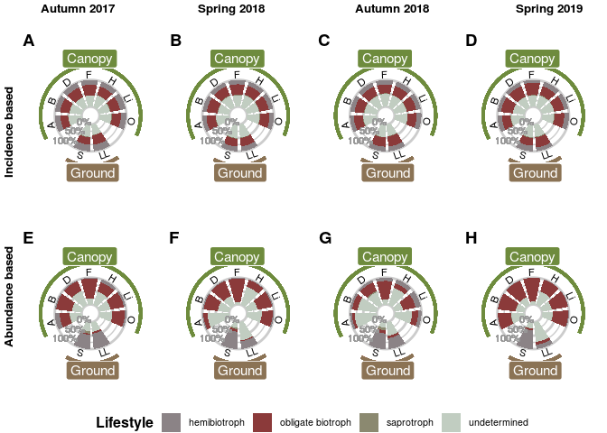
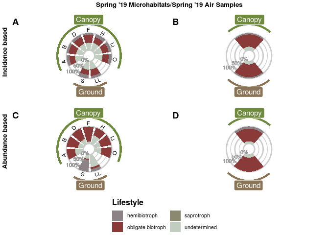

Seasonal\_FunctionalDiversity
================

## Define Input

Here, we need two files:

1.  The OTU table including the metadata columns
2.  The taxonomic annotation including the functional annotation

Next we define the files and libraries needed:

``` r
rm(list = ls())

library(ggplot2)
library(reshape2)
library(phenotypicForest)
library(magrittr)
library(ggpubr)

TAX = read.csv("../00_Data/04_Oomycota_Seasonal_OTU_ContingencyTable_filtered_sequences_NCBI-nt_blasted_sorted_BestHit_TaxonomyTable_Oomycetes_sequences_vsearch-ITS1-BestHit_AnnotationRefined_noPipe_withFunction_noNA.tsv", 
                    header = F, 
                    sep = "\t", 
                    stringsAsFactors = T)
OTU_Table = as.data.frame(read.csv("../00_Data/05_Oomycota_Seasonal_OTU_Table_min-freq-1172_transposed_withMetadata.tsv", 
                     header = T, 
                     sep = "\t", 
                     stringsAsFactors = T))

SampleMetadata = OTU_Table[,1:17]
OTU_Table = OTU_Table[,18:ncol(OTU_Table)]

# Calculate the total abundance of each OTU by summing the columns
Abundances = colSums(OTU_Table)
TAX = cbind(TAX, Abundances)

colnames(TAX) = c("OTU_Number", "Order", "Family", "Genus", "Species", "ReferenceID", "PercentID", "Lifestyle", "Substrate", "Abundance")
TAX$OTU_ID = paste0("OTU", TAX$OTU_Number, "_", TAX$Species)
TAX$Lifestyle = as.factor(TAX$Lifestyle)
```

## Aggregate Table

Now we need to aggregate the Table. We combine the forms of Lifestyle
and the Microhabitats, so we have a 9x4 dataframe containing the number
of reads per Lifestyle per Habitat

``` r
FuncData = function(MicrohabitatPerSampling, incidence){
LifestyleTable = OTU_Table
colnames(LifestyleTable) = TAX$Lifestyle

# First aggregate by Habitat
HabitatAggregatedLifestyleTable = 
  aggregate(LifestyleTable, 
            by = list(SampleMetadata$MicrohabitatPerSampling), 
            FUN = sum)
rownames(HabitatAggregatedLifestyleTable) = 
  HabitatAggregatedLifestyleTable$Group.1
HabitatAggregatedLifestyleTable = 
  HabitatAggregatedLifestyleTable[,-1]

# if you want to check the number of OTUs instead of the amount of reads:
# this is the point to convert it into a presence/absence matrix like this:
if(incidence == T){
HabitatAggregatedLifestyleTable[,] = 
  ifelse(HabitatAggregatedLifestyleTable[,] > 0, 1, 0)
}
#Then aggregate the (transposed) table by Lifestyle
HabitatAggregatedLifestyleTable = 
  aggregate(t(HabitatAggregatedLifestyleTable), 
            by = list(TAX$Lifestyle), 
            FUN = sum)
rownames(HabitatAggregatedLifestyleTable) = 
  HabitatAggregatedLifestyleTable$Group.1
HabitatAggregatedLifestyleTable = 
  HabitatAggregatedLifestyleTable[,-1]
HabitatAggregatedLifestyleTable = 
  as.data.frame(HabitatAggregatedLifestyleTable)

# melt the table so ggplot can interpret it as a histogram
data = HabitatAggregatedLifestyleTable
data$Lifestyle = rownames(data)
data2 = melt(data, id.vars = "Lifestyle")

# add the Stratum
data3 = data2
data3$Stratum = ifelse(grepl("Leaf Litter|^Soil", data2$variable), 
                       "Ground", "Canopy")

# for the plotting we need to change the column names
colnames(data3) = c("score", "item", "value", "family")

data4 = data3[grepl(MicrohabitatPerSampling, data3$item),]

data4$item = sub(paste0(" ", MicrohabitatPerSampling), "", data4$item)

return(data4)
}
```

## Plot the table

Here we use the `polarHistogram` function from the [phenotypicForest
package](http://htmlpreview.github.io/?https://github.com/chrislad/phenotypicForest/blob/master/inst/doc/PhenotypicForests.html)
which builds a ggplot-like circular Histogram. I think it looks nicer
than a stacked bar chart.

``` r
PolarPlot = function(a){
P = polarHistogram(a, guides = NA, familyLabels = F, circleProportion = 1, 
               alphaStart = -2.05, innerRadius = 0.25, direction = "inwards") +
  scale_fill_manual(values = c("lavenderblush4", "indianred4", 
                               "lemonchiffon4", "honeydew3"), 
                    limits = c("hemibiotroph", "obligate biotroph", 
                               "saprotroph", "undetermined")) +
  # the default theme looks weird for polar histograms and also produces a wrong scale
  # so here we manually add the coordinates
  theme_void() +
  lims(y = c(0, 1.65)) +
  labs(fill = "Lifestyle") +
  theme(legend.text = element_text(size = 8), 
        legend.title = element_text(size = 12, face = "bold")) +
  geom_text(x = 12.2, y = 0.25, label = "0%", color = "grey60", size = 3) +
  geom_text(x = 12.2, y = 0.625, label = "50%", color = "grey60", size = 3) +
  geom_text(x = 12.2, y = 1, label = "100%", color = "grey60", size = 3) +
  geom_segment(x = 0, xend = 8.2, y = 1.4, yend = 1.4, 
               size = 1.2, color = "darkolivegreen4", linetype = "solid") +
  geom_segment(x = 9.4, xend = 11.6, y = 1.4, yend = 1.4, 
               size = 1.2, color = "burlywood4", linetype = "solid") +
  geom_label(x = 4.15, y = 1.6, fill = "darkolivegreen4", color = "white", 
             label = "Canopy", size = 4) +
  geom_label(x = 10.5, y = 1.6, fill = "burlywood4", color = "white", 
             label = "Ground", size = 4)
P$plot$dfItemLabels$item = c("A", "B", "D", 
                             "F", "H", "Li", 
                             "O", "LL", "S")
P = P + geom_text(data = P$plot$dfItemLabels, x = as.numeric(P$plot$dfItemLabels$x), 
            y = 1.15, label = P$plot$dfItemLabels$item, size = 3, 
            angle = as.numeric(ifelse(as.numeric(P$plot$dfItemLabels$angle) < 0,
                                      as.numeric(P$plot$dfItemLabels$angle) + 90,
                                      as.numeric(P$plot$dfItemLabels$angle) - 90)) %>%
              add(ifelse(P$plot$dfItemLabels$item %in% c("A", "O"),
                         180, 0)))

P$layers = c(geom_hline(color = "grey80", yintercept = 0.25, size = 1), # will be 0
             geom_hline(color = "grey80", yintercept = 1, size = 1), # will be 1
             geom_hline(color = "grey80", yintercept = (1-0.25)/2+0.25, size = 1), # will be 0.5
             geom_hline(color = "grey80", yintercept = (1-0.25)/4+0.25), # will be 0.25
             geom_hline(color = "grey80", yintercept = (1-0.25)/4*3+0.25), # will be 0.75
             P$layers)
P$layers[[7]] = NULL
return(P)
}

FuncAutumn2017 = FuncData("Autumn 2017", incidence = F)
FuncAutumn2017_incid = FuncData("Autumn 2017", incidence = T)
P_Autumn2017 = PolarPlot(FuncAutumn2017)
P_Autumn2017_incid = PolarPlot(FuncAutumn2017_incid)

FuncSpring2018 = FuncData("Spring 2018", incidence = F)
FuncSpring2018_incid = FuncData("Spring 2018", incidence = T)
P_Spring2018 = PolarPlot(FuncSpring2018)
P_Spring2018_incid = PolarPlot(FuncSpring2018_incid)

FuncAutumn2018 = FuncData("Autumn 2018", incidence = F)
FuncAutumn2018_incid = FuncData("Autumn 2018", incidence = T)
P_Autumn2018 = PolarPlot(FuncAutumn2018)
P_Autumn2018_incid = PolarPlot(FuncAutumn2018_incid)

FuncSpring2019 = FuncData("Spring 2019", incidence = F)
FuncSpring2019_incid = FuncData("Spring 2019", incidence = T)
P_Spring2019 = PolarPlot(FuncSpring2019)
P_Spring2019_incid = PolarPlot(FuncSpring2019_incid)

combi = ggarrange(P_Autumn2017_incid, P_Spring2018_incid, 
                  P_Autumn2018_incid, P_Spring2019_incid, 
                  P_Autumn2017, P_Spring2018, 
                  P_Autumn2018, P_Spring2019, 
                  labels = c("AUTO"), 
                  ncol = 4, nrow = 2, 
                  common.legend = T, legend = "bottom", 
                  align = "hv", vjust = 2.5) %>%
  annotate_figure(top = text_grob("Autumn 2017                       Spring 2018                         Autumn 2018                        Spring 2019", 
                                  face = "bold", size = 10), 
                  left = text_grob("Abundance based                   Incidence based", 
                                  face = "bold", size = 10, rot = 90))

load("Air_FunctionalPlot_incidence.RData")
load("Air_FunctionalPlot.RData")
P_Air_Functional$scales$scales[[2]]$limits = c(0, 1.65)
P_Air_Functional$layers[[9]]$aes_params$size = 3
P_Air_Functional$layers[[10]]$aes_params$size = 3
P_Air_Functional$layers[[11]]$aes_params$size = 3
P_Air_Functional$layers[[12]]$aes_params$y = 1.4
P_Air_Functional$layers[[12]]$aes_params$yend = 1.4
P_Air_Functional$layers[[12]]$aes_params$linetype = "solid"
P_Air_Functional$layers[[13]]$aes_params$y = 1.4
P_Air_Functional$layers[[13]]$aes_params$yend = 1.4
P_Air_Functional$layers[[13]]$aes_params$linetype = "solid"
P_Air_Functional$layers[[14]]$aes_params$size = 4
P_Air_Functional$layers[[15]]$aes_params$size = 4
P_Air_Functional$layers[[14]]$aes_params$y = 1.6
P_Air_Functional$layers[[15]]$aes_params$y = 1.6
P_Air_Functional_incid$scales$scales[[2]]$limits = c(0, 1.65)
P_Air_Functional_incid$layers[[9]]$aes_params$size = 3
P_Air_Functional_incid$layers[[10]]$aes_params$size = 3
P_Air_Functional_incid$layers[[11]]$aes_params$size = 3
P_Air_Functional_incid$layers[[12]]$aes_params$y = 1.4
P_Air_Functional_incid$layers[[12]]$aes_params$yend = 1.4
P_Air_Functional_incid$layers[[12]]$aes_params$linetype = "solid"
P_Air_Functional_incid$layers[[13]]$aes_params$y = 1.4
P_Air_Functional_incid$layers[[13]]$aes_params$yend = 1.4
P_Air_Functional_incid$layers[[13]]$aes_params$linetype = "solid"
P_Air_Functional_incid$layers[[14]]$aes_params$size = 4
P_Air_Functional_incid$layers[[15]]$aes_params$size = 4
P_Air_Functional_incid$layers[[14]]$aes_params$y = 1.6
P_Air_Functional_incid$layers[[15]]$aes_params$y = 1.6

P_Air_Functional = P_Air_Functional + 
  theme(legend.text = element_text(size = 8), 
        legend.title = element_text(size = 12, face = "bold"))
P_Air_Functional_incid = P_Air_Functional_incid + 
  theme(legend.text = element_text(size = 8), 
        legend.title = element_text(size = 12, face = "bold"))

combiSpring2019 = ggarrange(P_Spring2019_incid, P_Air_Functional_incid,
                            P_Spring2019, P_Air_Functional,
                            labels = "AUTO", ncol = 2, nrow = 2, 
                            common.legend = T, legend = "none", 
                            vjust = 2.5) %>%
  annotate_figure(top = text_grob("Spring '19 Microhabitats/Spring '19 Air Samples", 
                                  face = "bold", size = 10), 
                  left = text_grob("Abundance based                   Incidence based", 
                                  face = "bold", size = 10, rot = 90))

P_Spring2019_incid = P_Spring2019_incid +
  guides(fill=guide_legend(ncol=2))

l = get_legend(P_Spring2019_incid)

combiSpring2019_legend = ggarrange(combiSpring2019, l, 
                                   ncol = 1, nrow = 2, 
                                   heights = c(1, 0.2))

ggsave("Functional.pdf", plot = combi, 
       device = "pdf", dpi = 300, width = 18, height = 10, 
       units = "cm")
ggsave("Functional.png", plot = combi, 
       device = "png", dpi = 300, width = 18, height = 10, 
       units = "cm")
ggsave("Functional.jpeg", plot = combi, 
       device = "jpeg", dpi = 300, width = 18, height = 10, 
       units = "cm")

ggsave("Functional_Spring2019.pdf", plot = combiSpring2019_legend, 
       device = "pdf", dpi = 300, width = 8.5, height = 12, 
       units = "cm")
ggsave("Functional_Spring2019.png", plot = combiSpring2019_legend, 
       device = "png", dpi = 300, width = 8.5, height = 12, 
       units = "cm")
ggsave("Functional_Spring2019.jpeg", plot = combiSpring2019_legend, 
       device = "jpeg", dpi = 300, width = 8.5, height = 12, 
       units = "cm")

combi
```

<!-- -->

``` r
combiSpring2019_legend
```

<!-- -->
